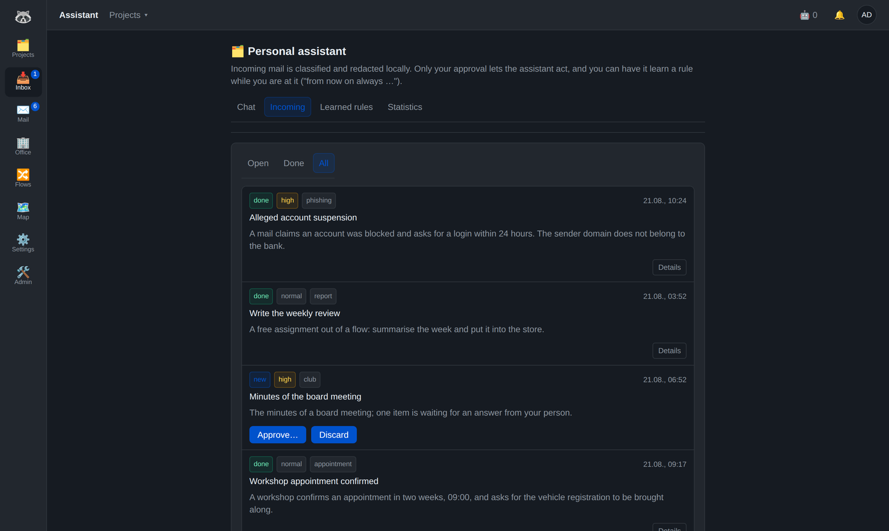
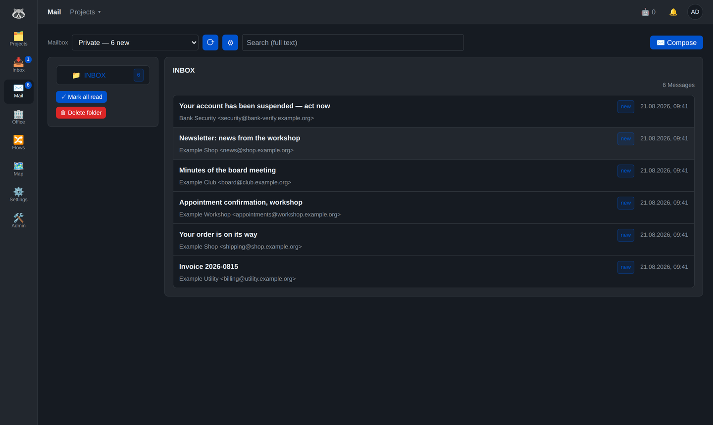
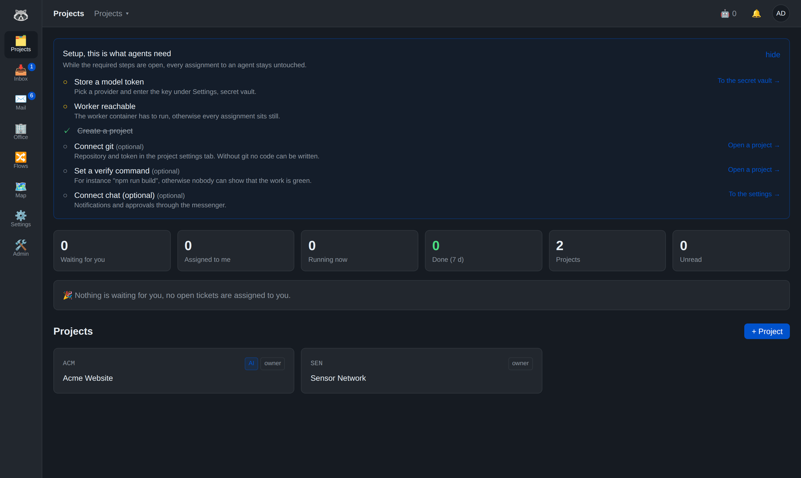
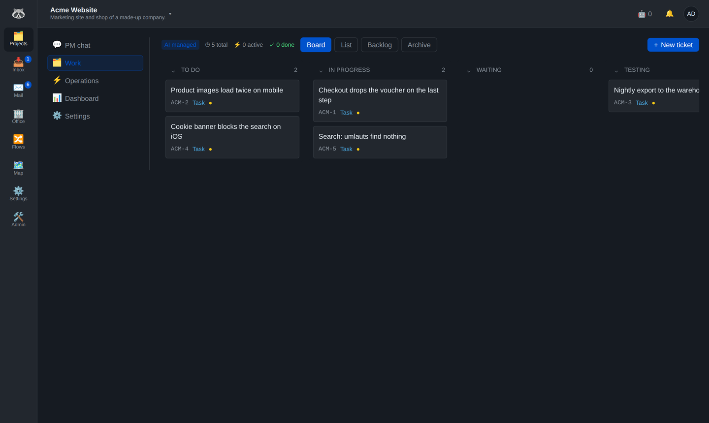
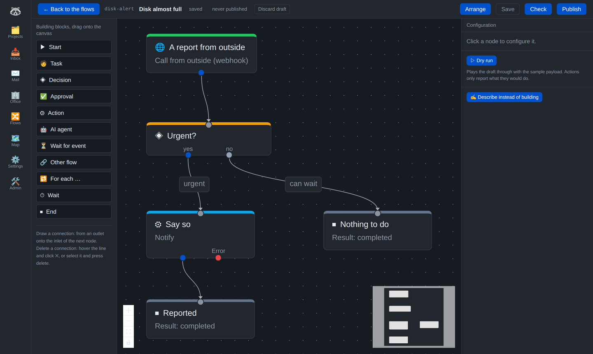
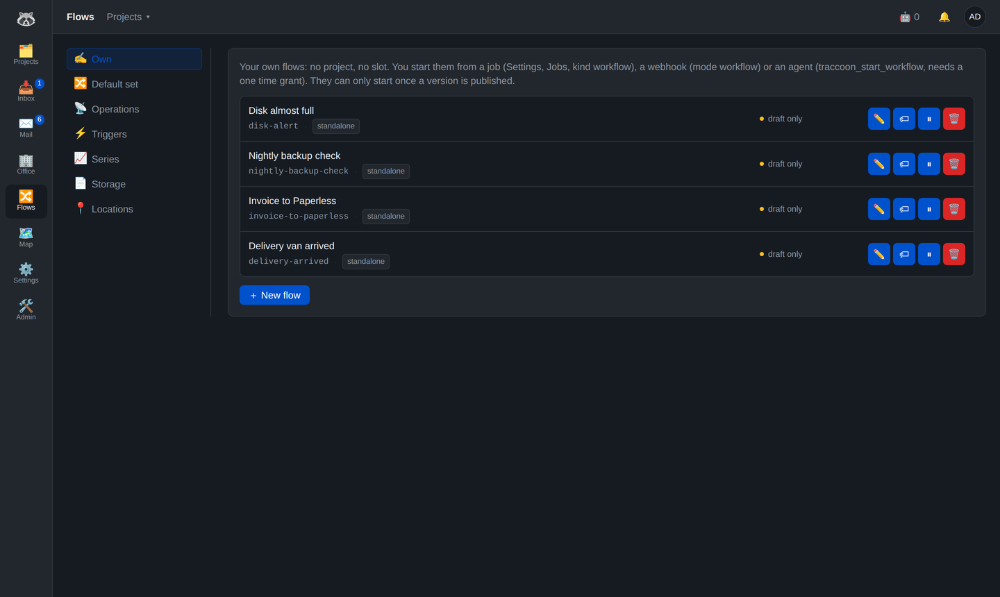
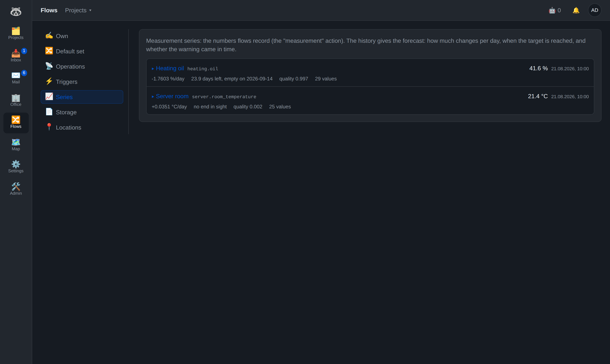
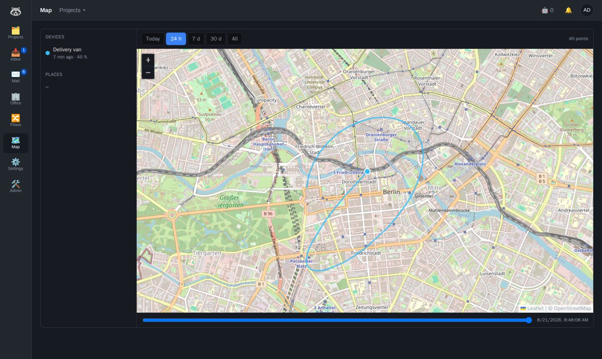

# Traccoon

**A personal assistant with the keys to your own house — and the machinery that keeps it
running.**

Traccoon started as a ticket system and is no longer one. What stands at the front today is
an assistant that belongs to one person: it sits above the projects, reads the mail as it
arrives, prepares drafts, keeps appointments and contacts, files documents and notes, and
asks before it does anything that reaches the outside world. You talk to it in the browser
or from your messenger, and it works with the tools you already run — your mailbox, your
document archive, your notes, your calendar, your photos.

Behind it stands the rest: flows drawn instead of programmed, jobs, webhooks, data series,
a ticket system with agents that write code. That part is why the assistant can act at all —
but it is the basement, not the front door.

Everything self-hosted, on your own Docker host, in your own database.

## Why you would run it

**An assistant that actually reaches into things.** Not a chat window next to your work but
one that opens your mailbox, writes into your vault, files a PDF, looks up an appointment.
In the instance this is written in, 579 assignments have reached it since it went up: 438
came out of mail, 129 from a Telegram chat, the rest were free assignments. It decides on
its own what to do with a matter — and stops before anything that leaves the house: sending
a mail, an appointment with other people, deleting something. That is a question, not an
action.

**Local models next to commercial ones — for the data that must not leave.** Every agent
picks its own provider and model. Here the mail classifier runs on a **local** Qwen while
the assistant thinks with Claude. That is the whole point: a mail is read in-house first,
summarised and redacted locally, and only the redacted summary travels on. The full text
stays on the IMAP server; it is fetched only when it is really needed for a step. The same
applies to voice messages, which are transcribed locally, and to the spam judgement, whose
model never leaves the machine. Providers are named tokens (private, work, local), with a
fallback per agent — no key in an environment variable, no single account for everything.

**A mail client, not a mail integration.** Accounts, identities, folders, an archive pattern
built from the date OF THE MAIL, search, drafts, sending — a real client in the browser. The
same mailbox is what the assistant works in, with a per-tool release: reading, refiling and
sending are three separate switches, and folders can be made invisible to tools entirely.
Above it sits spam detection out of three voices (rules, the local model, and a memory of
your own decisions), which asks back instead of deciding silently.

**Your messenger is the second window.** Telegram carries the notifications, and a
notification is a card with buttons: approve a plan, recall a spam decision, answer a
question. What you write back becomes a comment or an answer inside a running flow. Voice
messages work too — transcribed locally, never in a cloud.

**Drawn, not programmed.** Every process — the mail intake, a nightly check, procurement,
the ticket lifecycle — is a graph in the browser. New behaviour costs a few nodes, not a
deployment. Describe it in one sentence and a model drafts the graph; a dry run plays it
through without touching anything.

**AI you invite, not AI that happens to you.** A code agent moves only after an explicit
assignment, and only where the AI permission was granted. It plans first, a person approves
the plan, it works in a git worktree of its own, the build has to be green, and the result
goes to review. Cost, iteration and time limits are hard walls. Without the permission the
entire AI surface stays hidden and you have a plain, perfectly usable project tool.

**One house instead of six services.** Mail, assistant, cron, workflows, notifications,
tickets, sensor readings and locations under one login — and because they share one house
they reach each other: a mail becomes a ticket, a sensor value becomes a decision, a
deadline becomes a message, a device reports its position and a place it enters starts a
flow.

> **Status:** in production here, but there are no releases, no upgrade guarantees and no
> tenant isolation. You should be comfortable with Docker and PostgreSQL. See
> [Status and limits](#status-and-limits).

## In pictures

The screenshots come from a demo instance with invented data (`docs/demo/`) — Ada Lovelace
works at Acme, her mail comes from a throwaway mail server, and the delivery van drives
through Berlin. Nothing in them belongs to a real person.

| | |
|---|---|
|  **The assistant** — what came in, what it did, what it wants a yes for. |  **Mail** — your own mailbox, read and written in the house itself. |
|  **Start page** — what waits for you, across projects. |  **Board** — tickets, states and who is on them. |
|  **Flow editor** — a process as a graph, with a dry run. |  **Flows** — your own, the shipped set, triggers, series. |
|  **Series** — a number with a forecast: when is it empty? |  **Map plugin** — locations, drawn by a plugin, not by the core. |

## The two rules

**The assistant acts, but stops at the door.** It decides on its own what to do with a
matter — note it in the vault, prepare a draft, file a document, look something up. It does
not decide anything that reaches the outside world: sending a mail, an appointment with
other people, deleting something. Those become a question with buttons in your messenger,
and the answer travels back into the running flow.

**A code agent touches a ticket only on explicit assignment.** Assigning requires the AI
permission `ai_assign` in that project, a separate permission next to the role. Without it
the entire AI surface stays hidden and Traccoon is a plain ticket system. Assignment usually
goes to the **project manager agent**, which decides staffing and splitting and delegates to
execution agents. Two points always stay with a human: plan approval and final review.

## What it does

### The assistant

- **It belongs to one person, not to a project.** Its own inbox, its own memory, its own
  tool set. Every item shows where it came from (a mail, the chat, a flow) and what the
  assistant did about it
- **Tools instead of talk:** whatever you run as an MCP server it can use — a mailbox, a
  document archive, a vault of notes, a calendar and contacts, photos, time tracking. In
  this instance fifteen of them, each released per tool, not per server
- **A memory that outlasts the run.** What your person taught it lands as a line in a note
  in your vault — visible, correctable by hand, and hung into the next prompt. It writes
  there itself with `remember`, corrects itself with `forget`
- **Two ways in:** the inbox in the browser, and the messenger. A voice message works as
  well as a typed one
- **Free assignments too:** a flow can hand it a job (`assistant_task`), with or without
  waiting for the result

### Mail

- **A real client:** accounts and identities, folders as a tree, search, drafts, sending,
  attachments. An archive pattern (`Archive/{jahr}/{monat}`) is filled from the date OF THE
  MAIL, so an invoice from 2023 still lands in 2023
- **Actions are flows.** A button on a mail or on an attachment starts a graph and puts
  account, folder, UID and the chosen attachment into its context. "Attachment to Paperless"
  is a template, not a feature
- **The same mailbox for the assistant**, with a release per tool: reading, refiling and
  sending are three separate switches, and folders in the ignore list do not exist for tools
  at all. House rules per mailbox travel into the prompt, so "never send without asking"
  applies where it belongs
- **The mailbox reports by itself** (IMAP IDLE) instead of being polled

### Spam, judged by three voices

- **Rules** (SPF, DKIM, DMARC, forgery patterns, role addresses, link and attachment
  checks), a **local model** so that nothing raw leaves the house, and a **memory** that
  learns from your own decisions — in this instance about 1600 learned features
- A question comes back as a card with buttons; the verdict is measured against your own hit
  rate afterwards. Whoever contradicts twice is not asked a third time
- The local classifier also decides what travels: only the redacted summary goes on to the
  bigger model, the full text stays on the server

### Models, local and commercial

- Every agent picks its provider and model itself, with a fallback: a subscription
  account for the big steps, a **local** endpoint for what must not leave the house.
  In this instance the mail classifier runs on a local Qwen while the assistant thinks
  with Claude
- Providers are **named tokens** (private, work, local) instead of one key in an
  environment variable — an account is chosen per agent, not per installation
- Anything that speaks the chat-completions protocol works as a local endpoint
  (llama.cpp, Ollama, LiteLLM in front of them). Cost per run is measured either way,
  and a local model simply costs nothing
- Voice messages are transcribed locally as well, on the CPU or on the iGPU

### Projects, tickets, hardware

- Nested projects with inherited membership, roles (owner, maintainer, member, viewer) and
  the `ai_assign` permission
- Configurable issue types and states, kanban board with stable ordering, sprints, saved
  filters, tags, links, attachments
- Comments with visibility (public, internal, agent). A comment can advance a waiting flow
- **Artifacts** as a shared model: tickets, hardware items and your own types share fields,
  states and processes. Projects extend their artifacts without code
- **Hardware:** catalog, item, location tree, procurement chain with handover to people,
  fine grained grants per location or device

### AI agents

- Own tool loop instead of a third party agent framework. It talks to subscription accounts
  as well as self-hosted models over chat compatible HTTP endpoints, with provider routing,
  cooldown and fallback
- Tools: read, write and edit files, run the build check, deploy, take screenshots, ask a
  human, submit a plan, continue later
- **Runtime permission gate** (allow, ask, deny) with one-shot grants. Approval comes from
  the UI or from a message
- **One git worktree per ticket**, pre-merge check, conflicts go back to the agent, build
  gate before review, test environment per ticket
- Cost tracking per run, runaway brakes, night and after-hours windows, wall clock limit,
  continuation after an iteration or time limit with a proper handover instead of memory
  loss
- **PM chat:** talk to the project manager, which turns the conversation into tickets
- **Office:** a pixel view of all running agents plus an end-of-day film as a GIF

### Process engine

Every flow is a directed graph, drawn in the browser:

| Building block | What it does |
|---|---|
| Start | manual, an event inside Traccoon, or an incoming webhook |
| Task, approval | a person does something or approves it (with form fields) |
| Decision | conditions over the run context (JSONLogic, with field picker in the editor) |
| Action | set a state, create a ticket, comment, call a destination, **call a tool**, record a measurement, notify |
| AI agent | an agent run as a step inside the flow |
| Wait for event, wait for time | a comment, a reply, or simply the clock |
| For each | walk a list item by item |
| Other flow | start a second flow as a subprocess |

On top of that:

- **Templates:** nine ready-made flows as a starting point — report from outside, scheduled
  check with approval, work through a list, call with retry, mail intake, attachment to
  Paperless, and the three short ways from a trigger (to the assistant, to a message, to a
  ticket)
- **Describe instead of build:** one sentence is enough, a model draws the graph. The draft
  lands on the canvas, saving stays manual
- **Dry run:** the flow runs end to end, every action only reports what it would do
- **Step log per run:** what each step returned and which branch it took
- **Expressions** `{{ path | filter:argument }}` with 24 filters (shorten, round, format
  dates, fall back). Unquoted filter arguments may themselves be context paths
- **Process sets:** one shipped default plus a copy per project (copy on write, resettable)
  for the four flows Traccoon sets off by name: AI lifecycle, acceptance, procurement,
  ticket intake. The mail inbox is deliberately not among them — it is nobody's default but
  one person's flow, and lives as a template. A personal set exists in the API; the interface
  no longer offers one, because it was a full copy of ALL slots and event-driven flows then
  ran twice
- Anyone may create free-standing flows. They act only on artifacts the owner has rights to
- Retries with delay, an error outlet per action, nesting and step limits

### Connecting systems without code

- **Inbound:** webhooks with a GUID address, optional HMAC, filters on a header **or** on
  the payload (`payload:event.type`), idempotency over an arbitrarily deep field. Two modes
  only — raise an event, or start a flow. Everything a webhook used to do on its own (open a
  ticket, send a message, ask the assistant) is a node in that flow now
- **Outbound:** **destinations** hold base URL and authentication (basic, bearer, api key,
  HMAC, OAuth2 client credentials) in one place, callable from flows, jobs and, once
  granted, from agents
- **Tool servers (MCP):** own registry, self service per user. Every registered tool shows
  up in the flow editor as an action
- **Jobs:** cron, interval or one-shot, running a prompt, a script, an HTTP call or a flow.
  A job's parameter set becomes the flow's start context
- **Plugins:** own views as a zip — see below
- **Skills:** versioned instructions that agents receive

### Plugins

Traccoon itself needs no map. What it needs are series, sharing and triggers; drawing them
is exchangeable. So views live in plugins, and a plugin is a zip with a `manifest.json`.

A plugin runs in an iframe **without** `allow-same-origin`. It therefore has an opaque
origin: no access to the token in `localStorage`, none to the API, and the delivered CSP
sets `connect-src 'none'` — it cannot reach the network on its own at all. Whatever data it
needs it asks the host for over `postMessage`:

```js
const series = await traccoon.live("location");
const points = await traccoon.points("tracker.phone", { from: "2026-08-01T00:00:00Z" });
```

The host measures every call against two things: what the manifest declares under `reads`,
and what an admin has ticked off. Deny by default, like the tools of the agents — a manifest
may ask for anything, only a human grants it. A plugin never sees more than the logged-in
person may see, because the host uses the same endpoints as the UI.

Third-party libraries belong in the zip, not in a CDN: the CSP loads no foreign scripts, and
a plugin should start without internet. The map plugin ships Leaflet that way.

Plugins live in their own repository: [mcules/Traccoon-Plugins](https://github.com/mcules/Traccoon-Plugins).

### Data series

A series is a name, a kind and a sequence of points. The kind decides which fields count —
**number** (battery level, fill level), **location** (lat/lon) or **text**. One concept, one
write action, one place for sharing and clean-up, instead of the same structure three times.

Numbers answer the question you actually have: where is this heading, and when do I act?

- Least squares line over a selectable window: change per day, days left, date, quality
- Early warning N days ahead, exactly once per refill instead of daily
- **Silence watchdog:** reports when a series goes quiet, including the case where the far
  side is down and can no longer report its own failure
- Plausibility bounds, because devices report nonsense when they do not know a value. The
  view shows the history, a dashed forecast and lets you drop single outliers

Locations are the same mechanism with a different shape:

- **One address per device.** `POST|GET /api/ingest/<token>` recognises OwnTracks, Overland,
  Traccar/OsmAnd and flat JSON (what Home Assistant sends) **by their content**. You paste
  the address into the device and it works — no format setting anywhere
- **A rest filter** keeps the table from growing at a desk overnight as fast as on the
  motorway. A point is stored when the device moved far enough, or after an interval
- **Named places raise events.** Entering and leaving start flows, which is the whole reason
  locations live here and not in a map application next door. The fence deliberately does
  *not* depend on the rest filter: walking across a boundary takes fewer metres than the
  filter wants to see
- Devices are shared per device, not all-or-nothing

Deliberately no PostGIS: the extension is not in the image, the tests run against SQLite,
and for a handful of places per person a haversine loop in Python answers faster than a
database could accept the query.

### Stores

A flow that writes a text had nowhere to put it. The review an agent writes every morning
ended up in the output field of a job run: cut off at 20,000 characters, without a heading,
without a view, and findable only by whoever knew which run it was.

A store is built like a series and for the same reason — a name and a sequence of versions.
What stands in it (a review, a report, a log, a note) the flow knows; the store keeps it,
holds the older versions beside the current one and shows what changed between two of them.
Flows write with the `document` action and read back with `document_read`, and how many
versions a store keeps stands on the store.

### Notifications and the messenger

- **Telegram is the second window.** A notification is not a dead line of text but a card
  with buttons: approve a plan, recall a spam decision, answer a question. What you write
  back becomes a comment or the answer of a waiting step
- You can talk to the assistant there directly, and to any other agent by name — the list
  comes from the agents you actually have, not from a hard-wired handler
- **Voice messages** are transcribed **locally** (CPU or iGPU, both in-house), including a
  vocabulary of proper nouns the model could not know
- Everyone manages their own channels in the profile (chat, e-mail, or a destination of
  their own) and which one applies when the sender names none. That is the normal case: a
  flow often learns its recipient only at runtime
- **Throttle:** at most one message per key per N minutes. The message is throttled, the
  processing is not

### Language and devices

- Every text comes from a catalog, English as the source language and German shipped
  alongside. An admin edits any of them at runtime, adds a language, and exports or imports
  a catalog as JSON. A missing translation falls back to English, never to a raw key
- The same catalog covers what the server writes: notifications and the setup checklist go
  out in the language of the person who reads them
- Usable on a phone: one column instead of three in the flow editor, blocks are added by
  tapping instead of dragging, lists replace tables where columns would not fit.
  `tools/uitest/` measures it (overflow, touch targets, font sizes) across 42 screens at
  two widths (390 and 1400 px)

### Operations

- Deployer with access to the docker socket: build, health check, rollback, test
  environments per ticket, self-deploy safeguards
- Admin area: users, costs, model catalog, mail, global settings
- Start dashboard, process operations view (what runs, what is stuck), cost reports

## Architecture

| Service | Technology | Role |
|---|---|---|
| `backend` | Python 3.12, async | API, WebSockets, process engine, scheduler, PM orchestrator |
| `worker` | Python | agent tool loop in its own process, fed through a queue |
| `frontend` | TypeScript, React | UI including the flow editor |
| `db` | PostgreSQL 16 | storage |
| `redis` | Redis 7 | queue, event fan-out, flags |
| `deployer` | Python, docker socket | build, deploy, rollback, test environments |
| `telegram-bot` | Python | notifications and questions in the messenger |
| `shotter` | Node, headless browser | screenshots for agents |
| `whisper`, `asr-gpu` | Python | local speech recognition (CPU or GPU) |
| `filmer` | Node | end-of-day office film as a GIF |

About 109,000 lines of code and 1,148 automated tests across 97 files, plus browser probes
under `tools/uitest` for what only shows up in a browser.

## Getting started

```bash
git clone https://github.com/mcules/Traccoon.git
cd Traccoon
cp .env.example .env        # set JWT_SECRET, database access, bootstrap admin
docker compose up -d --build
```

- UI: `http://localhost:${FRONTEND_PORT:-8080}`
- API: `http://localhost:${BACKEND_PORT:-8800}/api`
- The first start creates the admin from `BOOTSTRAP_ADMIN_*`.

Out of the box Traccoon is a complete ticket system. Everything else is opt-in:

| For | What to configure |
|---|---|
| Agent runs | provider token in the **secret vault** |
| Chat notifications | bot token in `.env` (without it the integration stays asleep) |
| Email | SMTP under Administration, Mail |
| Tools in flows | tool servers under Settings, MCP |
| Voice messages | container `whisper` (CPU) or `asr-gpu` |

## Security

- Argon2id password hashing, JWT with session invalidation, manual account activation
- **Personal access tokens** for long lived clients (an Obsidian plugin, a script): named,
  scoped (`assistant`, `tickets`, `full`, deny by default), individually revocable, and not
  killed by a password change the way a session is. The secret half is shown exactly once
  and kept only as an Argon2 hash
- **Secret vault** (Fernet encrypted) for tokens and credentials. Values are never returned,
  only used
- Permissions are enforced server side: project roles, the AI permission, grants on
  locations and devices
- Agents run behind a permission gate, every tool call is traceable
- Inbound webhooks support HMAC, outbound calls go only to configured destinations
- Plugins fetch foreign content through a proxy with SSRF protection

## Status and limits

- **No releases, no migration guarantee.** Schema changes are applied additively at startup
  (`DEV_CREATE_ALL`), with Alembic revisions kept alongside. Take backups before you run
  this on anything you care about.
- **Multi-user yes, tenant isolation no.** Permissions apply per project and owner, an admin
  sees everything.
- **German and English.** Both catalogs ship complete, and every text can be changed or a
  further language added under Administration, Translations. Each person picks their
  language in their profile; the server writes its notifications in that language too.
- The agent path needs a deployable project with `compose.preview.yml` for test
  environments and review to run end to end.
- Model prices and identifiers in the catalog are defaults and editable in the UI.

## Contributing

Bug reports and ideas are welcome as issues. When you change something, explain the reason
in the comment. That is the house style here, not decoration.

## License

MIT, see [LICENSE](LICENSE).
